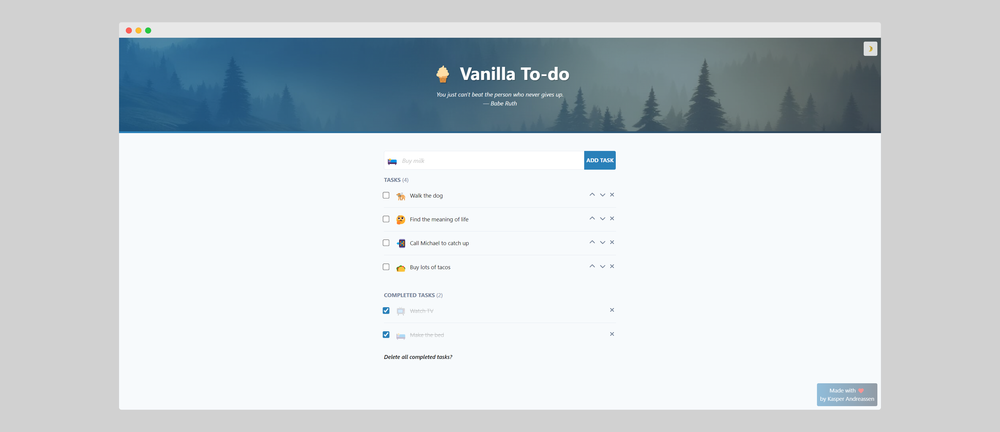
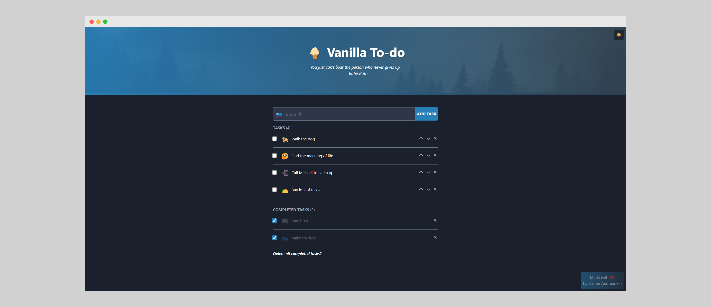
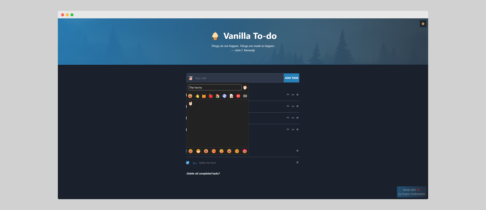

# 🍦 Vanilla To-do

Just what the world needed - yet another "To-do app".

This "app" is made in Vanilla JavaScript, meaning no frontend framework/library was used.

Vanilla To-do supports:

- ✅ Moving task position
- ✅ Saving tasks in local storage
- ✅ Deleting all completed tasks
- ✅ Dark mode
- ✅ Sick animations (Shout out, [AutoAnimate](https://github.com/formkit/auto-animate))
- ✅ Selecting emojis in multiple skin colors (Shout out, [emoji-picker-element ](https://github.com/nolanlawson/emoji-picker-element))
- ✅ Inspirational quotes to get the juices flowing (Shout out, [Quotable.io API](https://github.com/lukePeavey/quotable))

## Live demo

🔗 URL: [https://vanilla-to-do-app.netlify.app/](https://vanilla-to-do-app.netlify.app/)

## Screenshots





## Dependencies

It has two dependencies:

- [AutoAnimate](https://github.com/formkit/auto-animate) - used to add that sweet animation.
- [emoji-picker-element](https://github.com/nolanlawson/emoji-picker-element) - used for the task emoji picker.

The "app" also uses the [Quotable.io API](https://github.com/lukePeavey/quotable) to fetch a random, inspirational quote. If it fails to fetch, it will set a default quote.

### Dev dependencies

- [copy-webpack-plugin](https://github.com/webpack-contrib/copy-webpack-plugin)
- [html-webpack-plugin](https://github.com/jantimon/html-webpack-plugin)
- [webpack-cli](https://github.com/webpack/webpack-cli/tree/master/packages/webpack-cli)
- [webpack-dev-server](https://github.com/webpack/webpack-dev-server)

## Installation

Clone this project and install dependencies using `npm`, `yarn`, or `pnpm`.

To view the project locally run the `serve` script.

```bash
# npm
  npm install
  npm run serve

#yarn
  yarn install
  yarn run serve

#pnpm
  pnpm install
  pnpm run serve
```

## Author

Made by Kasper Andreassen

- GitHub: [@kasperadk](https://www.github.com/kasperadk)
- Web: [kasper.dk](https://kasper.dk)
- LinkedIn: [Kasper Andreassen](https://www.linkedin.com/in/kasperandreassen/)

## License

[MIT](https://choosealicense.com/licenses/mit/)
